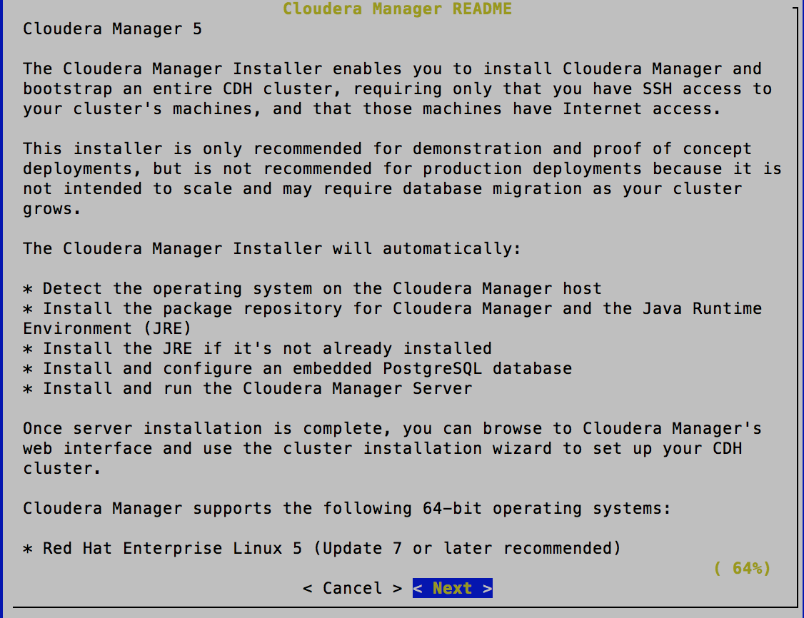

<!-- CSS work goes here for the time being -->
<!-- set a:link text-decoration to none -->
<!-- set a:hover text-decoration to underline -->
<!-- http://forums.markdownpad.com/discussion/143/include-pdf-pagebreak-instructions-in-markdown/p1 -->

---

## 
 <a name="cm_cdh_installation_section"/>Cloudera Manager & CDH Installation

* <a href="#install_methods">Installation Methods</a>
* <a href="#parcels">Understanding Parcels</a>
* <a href="#db_setup">Embedded vs. external database</a>
* <a href="#cm_cdh_key_points">Supplemental CM/DH Points</a>
* <a href="#cm_ui_overview">Cloudera Manager UI Overview</a>

---

## 
 <a name="install_methods"/> CM/CDH Installation

* We use Cloudera  Manager to:
    * Monitor host status (via an agent process)
    * Organize CDH clusters, deploy services
    * Set and observe service configuration
    * Automate common tasks: HA NameNode, Kerberos integration

---

## 
 Cloudera Manager architecture

  

---

## 
 <a name="cm_install_paths"/>Installation paths

* [Path A: One-stop binary installer](http://www.cloudera.com/content/cloudera/en/documentation/core/latest/topics/cm_ig_install_path_a.html)
    * Used for short-term, throwaway projects 
    * Embedded, hard-configured PostgreSQL server 
* [Path B: Install CM and database manually](http://www.cloudera.com/content/cloudera/en/documentation/core/latest/topics/cm_ig_install_path_b.html)
    * Any cluster meant to run more than 3-6 months
    * Supports Oracle, MySQL, and PostgreSQL servers
    * Can deploy CDH with Linux packages or [Parcels](http://www.cloudera.com/documentation/enterprise/latest/topics/cm_ig_parcels.html)
* [Path C: Tarballs](http://www.cloudera.com/content/cloudera/en/documentation/core/latest/topics/cm_ig_install_path_c.html)
    * Useful if privileged access is not available
    * Let other deployment tools drive
    * Don't need Cloudera Manager

---

## 
 <a name="cm_install_logging"/>CM Installation Milestones with Path A 

* Essential Linux configuration checks (e.g., SELinux disabled)
* Install package repositories for PostgreSQL and Cloudera Manager
* Install Oracle JDK 
* Install PostgreSQL
* Install Cloudera Manager
* Add hosts, deploy cluster -- most choices made for you

* We typically prepare for an install engagement by reviewing:
    * [Well-known issues](http://www.cloudera.com/content/cloudera/en/documentation/core/latest/topics/cm_ig_troubleshooting.html)
    * [Ongoing problems and workarounds](http://www.cloudera.com/content/cloudera/en/documentation/core/latest/topics/cm_rn_known_issues.html)
    * [Recently closed JIRAs](http://www.cloudera.com/content/cloudera/en/documentation/core/latest/topics/cm_rn_fixed_issues.html) too.

---

## 
 <a name="cm_install_milestones"/> Path B Steps 

0. Review hardware, OS, disk, and network/kernel settings
1. Install Oracle JDK
    * Included in Cloudera Manager's package repo 
    * OpenJDK is not (yet?) supported by Cloudera
2. Install [database server](http://www.cloudera.com/content/cloudera/en/documentation/core/latest/topics/cm_ig_installing_configuring_dbs.html?scroll=cmig_topic_5_2_unique_1#cmig_topic_5_1_unique_1)
3. Install the CM server and agent packages
    * MySQL requires a JDBC database connector
4. Install process distributes agent software 
5. Also distributes CDH (packages or parcels)
6. Deploys and enables services

---

## 
 <a name="parcels"/> Installing CDH with Parcels

Parcels are [CM-dedicated packages](https://github.com/cloudera/cm_ext/wiki/Parcels:-What-and-Why%3F)

* Bundle Cloudera's supported Hadoop components into one distribution 
    * With supplementary parcels for some components
* Simpler than managing Linux packages
    * Default location requires no privileges: <code>/opt/cloudera/parcels</code>
    * Easy to create and maintain a local parcels repo 
* Components bind to CM through [Custom Service Descriptors] (https://github.com/cloudera/cm_ext/wiki/CSD-Overview)
* Tarball with [manifest and layout rules](https://github.com/cloudera/cm_ext/wiki/Building-a-parcel)
    * List of contents kept in <code>meta/parcel.json</code> 
    * Client download checks via a <code>manifest.json</code> file kept by server

---

## 
 Parcel Lifecycle

  
 

* [How to manage parcels](http://www.cloudera.com/content/cloudera-content/cloudera-docs/CM5/latest/Cloudera-Manager-Installation-Guide/cm5ig_parcels.html)

---

## 
 Parcels Lifecycle 

* Lifecycle actions
    * Download
    * Distribute
    * Activate/deactivate
    * Remove
    * Delete

* The directory <code>/opt/cloudera/parcels/CDH</code> always links to the active parcel

---

## 
 <a name="db_setup"/>Setting up the database

* <a href="#cm_service_dbs">Services that use a database</a>
* <a href="#cm_embedded_db">CM's embedded database</a>
* <a href="#cm_replicate_db">CM database replication for HA</a>

---

## 
 <a name="cm_service_dbs"/>[Databases and Other Stores](http://www.cloudera.com/content/cloudera/en/documentation/core/latest/topics/cm_ig_installing_configuring_dbs.html) 

* Management Services (one CM instance)
    * Reports Manager (aka <code>rman</code>)
    * Navigator Audit & Metadata Servers (not covered this week)
    * Activity Monitor (<code>amon</code>) is only used by the MapReduce service 
    * Host and Service Monitors implement [LevelDB](https://github.com/google/leveldb) 
* CDH Services 
    * Hive Metastore
    * Sentry 
    * [Oozie](http://www.cloudera.com/content/cloudera/en/documentation/core/latest/topics/cm_mc_oozie_service.html#cmig_topic_14_unique_1)
    * [Hue](http://www.cloudera.com/content/cloudera/en/documentation/core/latest/topics/cm_mc_hue_service.html#cmig_topic_15_unique_1) 
    * Sqoop2 (Derby and PostgreSQL only)

---

## 
 <a name="cm_replicate_db"/> MySQL Replication for HA </a>

* Configuring Cloudera Manager for active-passive HA is non-trivial
    * Load balancer(s) that can proxy multiple ports
    * An independent, HA store for Management Services
    * Mechanism for fail-fast detection
* We'll [install MySQL and replicate the server](http://dev.mysql.com/doc/refman/5.5/en/replication-howto.html) 

---

## 
 <a name="cm_ui_overview"/>Path A Install Demo 

 

---

## 
 CM Install Labs - *Before* You Start

* Fork the repo to your own GitHub Account
    * In the Settings tab of your fork, enable the Issues feature
    * Add instructors as Collaborators (mfernest, dbeech)
    * Each lab section tells you what to submit and how
    * Clone your repo to your laptop
* Submit work in Markdown docs or PNG files 
    * Issue Pull Requests to the upstream repo for errors, typos
* Create an Issue in your repo called `Installation Lab`
     * Add it to the `Labs` milestone
     * Assign the label `Started`
* Use this Issue for all matters related to completing the lab
    * For example, add the `question` label if you're stuck or unclear on steps

---

## 
 CM Install Lab - Cloudcat

* You should already have a Cloudcat account 
* Create five EC2 nodes
    * <code>m3.xlarge</code> instances are good; <code>m3.large</code> are adequate
    * Don't use spot instances
    * Use one instance for Cloudera Manager and edge/gateway roles
    * Be sure to use a [Cloudera-supported OS](http://www.cloudera.com/content/cloudera/en/documentation/core/latest/topics/cm_ig_cm_requirements.html), preferably CentOS.

---

## 
 CM Install Labs - Path B Installation Overview

* Add your node names & IP addresses to `installation/0_nodeIPs.md`
* Document your configuration checks in `installation/1_preinstall.md`
* Install a MySQL server and replica
* Install the latest available releases of CM & CDH
* <a href="#parcels_repo_lab">Bonus: create a Parcels repository</a>

---

## 
 CM Install Lab
## 
 <a name="linux_config_lab"/>Linux Configuration Checks

The checklist below is culled from this [overview of critical
settings] (http://tiny.cloudera.com/7steps). It is a very small
part of a typical pre-engagement checklist.

Follow the steps below. In each case, use a command to show the
current value of each property covered. Show the command you used
to correct a value if needed, followed by the first command again
to show the change.

Capture this work in the file `installation/1_prechecks.md`.  Check
each node in your cluster, but you only need to report the results
on one of them.

1. Check `vm.swappiness` on all your nodes
    * Set the value to `1` if necessary
2. Set `noatime` on any non-root volumes you have
3. Set the reserve space on any non-root volumes to `0`
4. Set the user limits to maximum file descriptors and processes
5. Test forward and reverse host lookups for correct resolution
6. Enable the <code>nscd</code> service
7. Enable the <code>ntpd</code> service 

Comment on your lab issue that pre-checks are complete.

---

## 
 MySQL Installation Lab
## 
 <a name="mysql_replication_lab"/>Configure MySQL with a replica server

Choose one of these plans to follow:

**Plan One**: follow the steps [documented here](http://www.cloudera.com/content/cloudera/en/documentation/core/v5-3-x/topics/cm_ig_mysql.html?scroll=cmig_topic_5_5#cmig_topic_5_5_1_unique_1). 
**Plan Two**: Follow the steps given below 
**Plan Three**: You're a MySQL expert; freestyle it

Comment on your Issue which plan you intend to follow

---

## 
 MySQL installation - Plan Two Detail

1. Install the following MySQL 5.5 packages
    * <code>mysql</code> on all nodes
    * <code>mysql-server</code> on the server and replica nodes
    * Download and copy [the JDBC
    connector](http://dev.mysql.com/downloads/connector/j/5.1.html) to
    all nodes as required. Do **not** install the connector from a package.

2. You should not need to edit your <code>/etc/my.cnf</code> file
    * The starter file in the repo is a MySQL 5.1.x example, and is incomplete.
    * You will need to add proper settings to enable replication. Consult MySQL documentation.

3. Run the <code>mysql_install_db</code> program as the <code>mysql</code> user on the master and replica nodes node before you start the <code>mysqld</code> service. This should create files with the correct permissions.

4. Start the <code>mysqld</code> service.
4. Use <code>/usr/bin/mysql_secure_installation</code> to: 
    a. Set password protection for the server 
    b. Revoke permissions for anonymous users 
    c. Permit remote privileged login 
    d. Remove test databases 
    e. Refresh privileges in memory 
    f. Refreshes the <code>mysqld</code> service

5. On the master MySQL node, grant replication privileges for your replica node: 
    a. Log in with <code>mysql -u ... -p</code>  
    b. Note the FQDN of your replica host. 
    c. <code>mysql> **GRANT REPLICATION SLAVE ON \*.\* TO '*user*'@'*FQDN*' IDENTIFIED BY '*password*';**</code> 
    d. <code>mysql> **SET GLOBAL binlog_format = 'ROW';** </code> 
    e. <code>mysql> **FLUSH TABLES WITH READ LOCK;</code>**

6. In a second terminal session, log into the MySQL master and show its  status: 
    a. <code>mysql> **SHOW MASTER STATUS;**</code> 
    b. Capture the file name and byte offset. The replica uses this info to sync to the master. 
    c. Logout and dismiss the second session; remove the lock on the first with <code>mysql> **UNLOCK TABLES;**</code>

7. Now log on to the replica. Use the following statements to coneect with the master: 
    <code>mysql> **CHANGE MASTER TO**  **MASTER_HOST='*master host*',**  **MASTER_USER='*replica user*',**  **MASTER_PASSWORD='*replica password*',**  **MASTER_LOG_FILE='*master file name*',**  **MASTER_LOG_POS=*master file offset*;**</code>

8. Next, initiate slave operations and confirm sync up. 
    a. <code>mysql> **START SLAVE;**</code> 
    b. <code>mysql> **SHOW SLAVE STATUS \G**</code> 
    c. If successful, the <code>Slave_IO_State</code> field will read <code>Waiting for master to send event</code> 
    d. Once successful, capture this output and store it in <code>installation/2_replica_working.md</code> 
    e. If unsuccessful, review your log (<code>/var/log/mysqld.log</code>) for errors. If stuck, consult with a colleague or instructor.

---

## 
 CM/CDH Install Lab
## 
 Path B using Cloudera 5.5.x

[The full rundown is here](http://www.cloudera.com/content/cloudera/en/documentation/core/latest/topics/cm_ig_install_path_b.html?scroll=cmig_topic_6_6). Ensure the following settings:

* Do not apply Single User Mode. Do not. Don't do it.
* Use only Cloudera's standard repositories
* Ignore all wizard steps marked "(Optional)" in the docs
* Install the Data Hub Edition 
* Install CDH using parcels
* Rename your cluster to your GitHub name
* Enable the `Coreset` of CDH services if you have `m3.large` instances. 
* Deploy three ZooKeeper instances.
* Once you have a healthy cluster, take a screenshot of your home page 
    * Name the file `installation/3_cm_installed.png`.
* Mark your Issue 'submitted' if you won't attempt the Bonus lab.

---

## 
 Cluster install: Bonus lab
## 
 <a name="parcels_repo_lab"/>Create a local parcel repo (manual)

* Click the parcel indicator in CM's navigation bar
    * Under Settings, note the Remote Parcel Repository URLs value
* Default parcel links include:
    * [Latest CDH5 release](http://archive.cloudera.com/cdh5/parcels/latest)
    * [Latest CDH4 release](http://archive.cloudera.com/cdh4/parcels/latest)
    * Standalone components (such as Accumulo or Kafka)
* Follow the [documentation] (http://www.cloudera.com/documentation/enterprise/latest/topics/cm_ig_create_local_parcel_repo.html)
* Set the new repository location in Cloudera Manager
* Capture this setting in a screenshot and save it to `installation/4_local_repo.png` 
* Mark your Issue `submitted`

---

## 
 Cluster install: Bonus Material
## 
 <a name="scripted_install_lab"/>Auto-deployment

* If you are interested in learning about automating installs:
    * Fork/clone [Justin Hayes' auto-deploy project](https://github.com/justinhayes/cm_api/tree/master/python/examples/auto-deploy)
* No submissions are needed.

---

## 
 <a name="cm_cdh_key_points"/> Summary Points

* The CM release may be any later version than the CDH release
    * Several customers use CM 5.x to monitor CDH 4.x clusters
* Configuring CM HA is [publicly documented as of Cloudera 5.4](http://www.cloudera.com/content/cloudera/en/documentation/core/latest/topics/admin_cm_ha_overview.html)
* CDH has no dependencies on Cloudera Manager. There are however features in CM that are not part of upstream Hadoop.
* CM has a REST API
    * Each API version is a superset of all prior versions
    * Try `http://<i>your_cm_host</i>:7180/api/version` in your browser
    * Some endpoints won't work on 4.x CDH deployments
        * You can browse the [CM API here] (http://cloudera.github.io/cm_api/)

